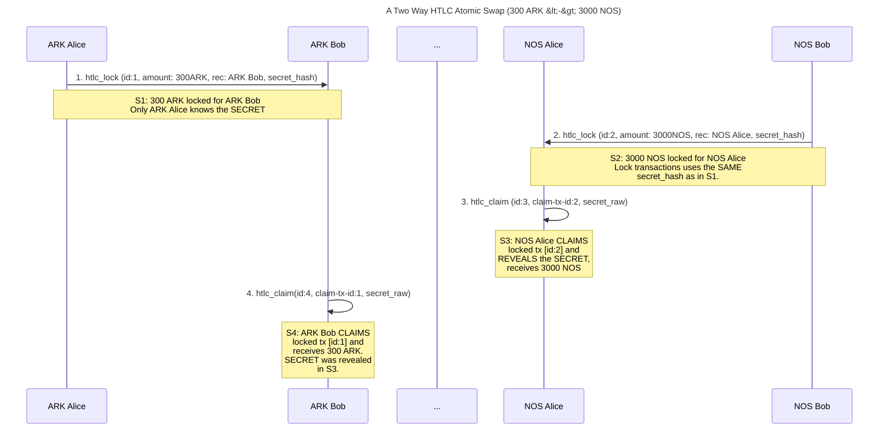

```mermaid
sequenceDiagram
  title: A Two Way HTLC Atomic Swap (300 ARK <-> 3000 NOS)
  participant A1 as ARK Alice
  participant A2 as ARK Bob
  participant ...

  A1->>A2: 1. htlc_lock (id:1, amount: 300ARK, rec: ARK Bob, secret_hash)
  Note over A1,A2: S1: 300 ARK locked for ARK Bob <br/>Only ARK Alice knows the SECRET

  participant X1 as NOS Alice
  participant X2 as NOS Bob
  X2->>X1: 2. htlc_lock (id:2, amount: 3000NOS, rec: NOS Alice, secret_hash)
  Note over X1,X2: S2: 3000 NOS locked for NOS Alice <br/>Lock transactions uses the SAME <br/> secret_hash as in S1.
  
  X1->>X1: 3. htlc_claim (id:3, claim-tx-id:2, secret_raw)
  Note over X1: S3: NOS Alice CLAIMS <br/> locked tx [id:2] and <br/> REVEALS the SECRET, <br/> receives 3000 NOS
  
  A2 ->> A2: 4. htlc_claim(id:4, claim-tx-id:1, secret_raw)
  Note over A2: S4: ARK Bob CLAIMS<br/>locked tx [id:1] and <br/> receives 300 ARK. <br/> SECRET was revealed<br/> in S3.
```
